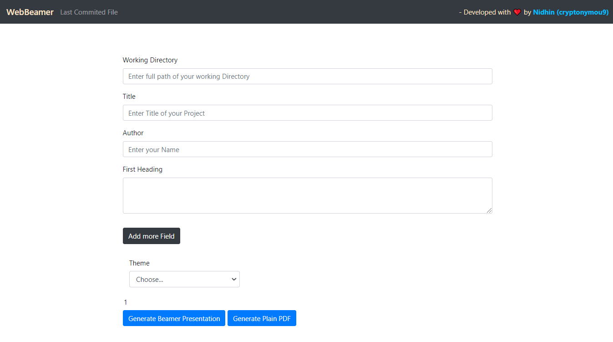
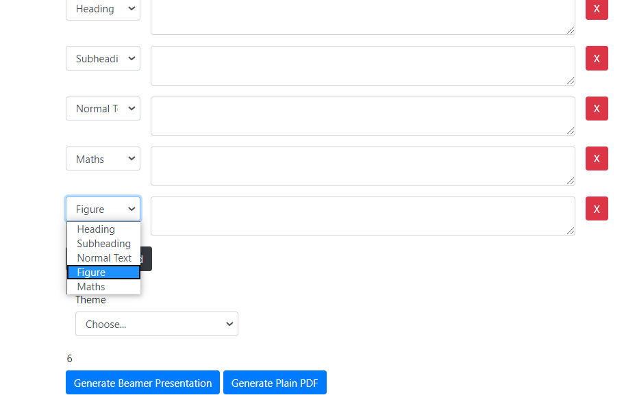
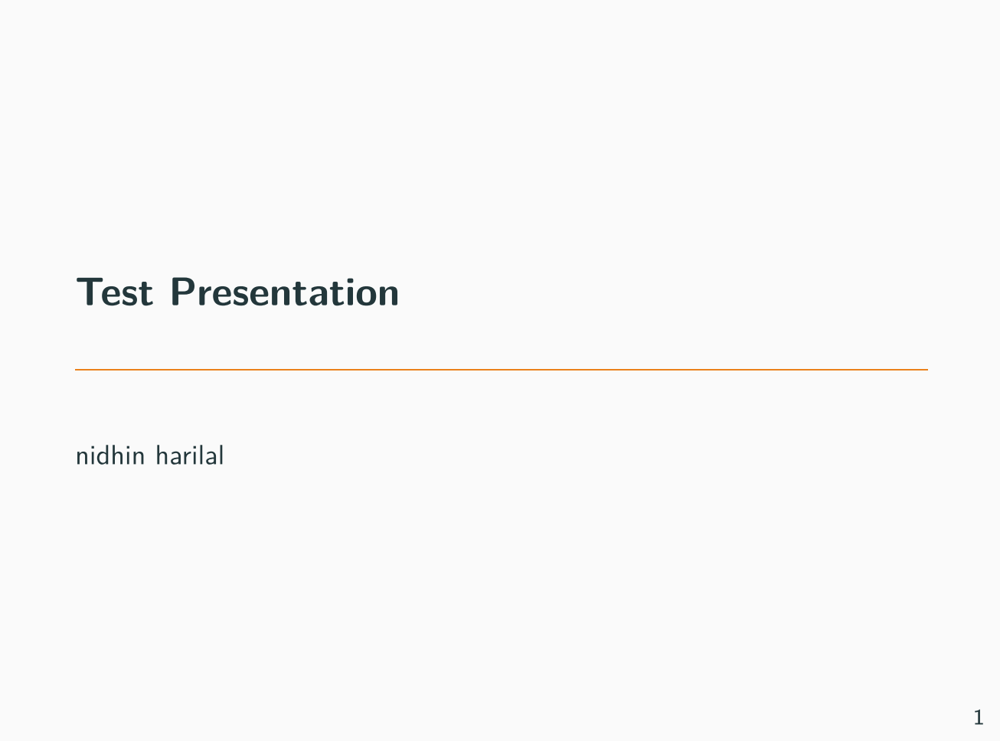

# WebBeamer :newspaper:

A `NodeJS` web-application  for making $\LaTeX$ based ​ beamer presentations.    

## Features:

The aim of this application is to provide an easy to use interface for making $\LaTeX$ based beamer presentations and documents.  Once installed, With the help of WebBeamer, you can help you make any kind of $\LaTeX$ based presentations efficiently without writing actually writing any $\LaTeX$ code.

**WebBeamer supports:**

* **Slides Info:** Presentation Title, Author Name and Page number of slides
* **Header**: Supports beamer like Heading, subheadings and text boxes. 
* **$LaTeX$**: Supports most of the $\LaTeX$ commands including all mathematical expressions.
* **Figures**: Supports importing figures with variable size.
* **Theme:** You can install custom beamer themes. All the available themes will show up in interface.  

## Interface:

### [1] 




### [2]




### [3] Presentation Sample with `Copenhagen` beamer theme:




## Requirements

**1)** You need can `pandoc`, which you can install  from [here](https://pandoc.org/).  Make sure you follow system requirements.

**2)** You need `Nodejs` in your system. You can install it from [here](https://nodejs.org/en/).

## Installation

This application requires [`pandoc`](http://johnmacfarlane.net/pandoc/) to be installed in your `PATH`. By default, the this application assumes `pandoc` to be in `PATH`. You can also, set your own, customized path to the executable.


Clone this repository and follow these commands: 

```she
cd ./Webeamer/

npm install
```

**That’s it!!** :clap:

## Usage

* To start the application, run the following command on the same directory:

```she
npm start
```

​		You application will be up and running at `localhost:3000`.

* The user interface is very simple. You can start adding the presentation title and author names. 
* You can add any number of pages using the `+` button.
* For each `+`, you can choose what this block you want to use for. 
  * Heading,
  * Sub-heading
  * General Text Box 
  * Figures (You need to provide exact file location.)
  * Mathematical Equations

* Bullets and inline math-equations follow the same rule as in $\LaTeX$

## Technical :runner:

### Backend:

1. NodeJS
2. Express  

### Frontend:

1. HTML
2. CSS
3. Boostrap 4
4. JQuery

### PDF Engine

1. Pandoc

### Node Packages

1. express
2. fs
3. shelljs
4. cors
5. eslint

### Node Debugging ​​

1. nodemon

## License

Free to contribute, use, copy and distribute. 💸

